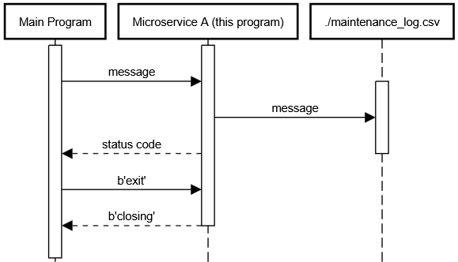

# CS361MainProj
## 3A 
### How to Request data from this microservice
To request information from this microservice, the user must have a ZMQ socket connected to tcp://localhost:5555. The user then must send a string via socket.send_string() or socket.send().
Ex:
```
print("sending message: date;name;desc")
socket.send_string("date;name;desc")
```

## 3B
### How to receieve data from this microservice
To receieve data from this microservice, the user must be connected to tcp://localhost:5555 and have sent a message via the method above. Then, the user must call socket.recv(), which will return the data from the microservice
Ex (msg has to be cast to string because zmq messages are sequences of bytes rather than strings):
```
msg = socket.recv()
print("received message: " + str(msg))
```

## 3C

